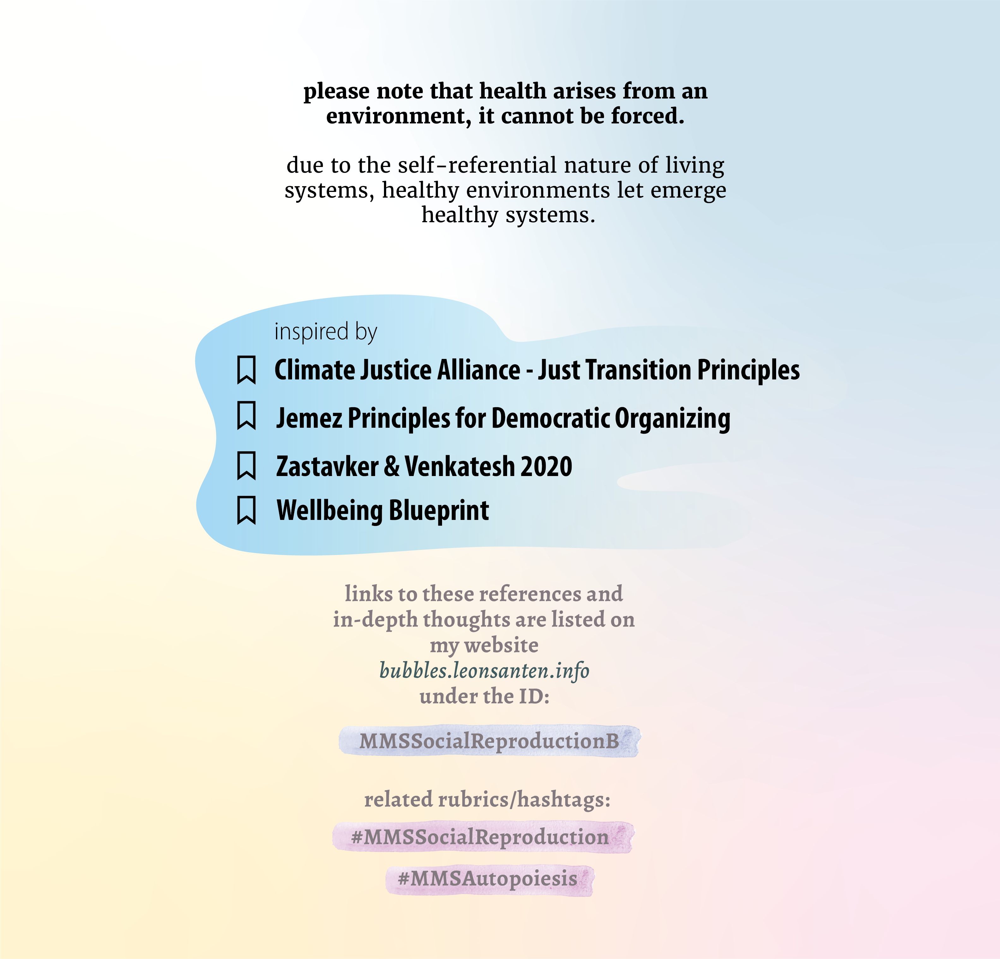

# A collection of my graphics
Dear critical creators at SF Chronicle, 

I only started creating intentional graphics in 2022. It is my new passion to communicate this way. Let me share with you what visuals I create *when...*

## when I visualize complex processes metaphorically...

## when I critically research common narratives...

## when I co-design with communities to envision change...

## when I design streamlined interfaces...
[bodywork.whitneyx.info](https://bodywork.whitneyx.info/)

## when I create visuals for papers...

## find more a longer portfolio [over here](https://leonsanten.info/marbles/COLLECTION-GRAPHICS-UI/)

Warmly, 

Leon 

