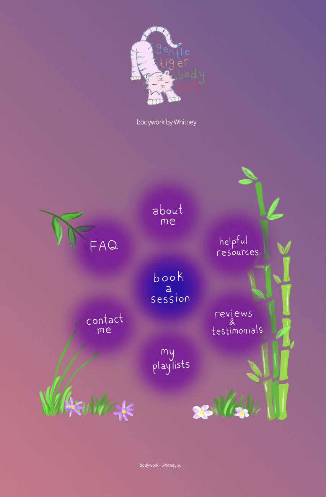

What visual spaces do we need to stay connected as a city?

add
- graphic of mesh projects bazaar
- wind turbine pros and cons
- interface for movement-oriented project sharing: this container helps us to share projects in a way that allows recipients to continue the depicted work instead of merely reading about its glory. 
## Underlying principles  that shape my visualizations
The visual structure should resemble the desired form of communication. Therefore, **graphic interfaces need to consider the underlying purpose of communication** to condition the behavior of the user. 

Consider typical Zoom interfaces! They do not resemble anything. 
![][MESH-CAP_summary-graphics-HIGH-RES-04.png]

For instance, we may visually represent 
![][MESH-CAP_summary-graphics-HIGH-RES-02.png]

## Visualizing entangled phenomena with metaphors - informed by *complex systems thinking*

add visualization of nature/ consciousness touching itself (eckhart tolle visual)
## unconventionally streamlined interfaces using low-tech 

[bodywork.whitneyx.info](https://bodywork.whitneyx.info/)
